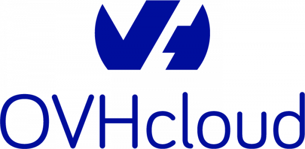
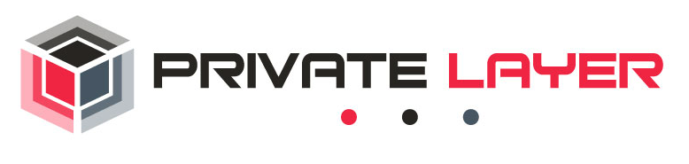

# Awesome Hosting Providers

A curated list of hosting providers that offer DDoS protection / no KYC / DMCA-ignored services.

## [BuyVM](https://buyvm.net)

**Description:** Privacy friendly provider

**Hosting Types:** VPS, VDS

**ASN:** [AS53667](https://bgp.tools/as/53667)

**Looking Glass:** [https://speedtest.lu.buyvm.net/](https://speedtest.lu.buyvm.net/)

**DMCA Ignored:** ✅ Yes

**DDoS Protection:** ✅ Yes

**Stateful DDoS Protection:** ❌ No

**Max DDoS Capacity:** 3.5 Tbps

**KYC Required:** ❌ No

**Privacy Policy:** [https://buyvm.net/privacy-policy/](https://buyvm.net/privacy-policy/)

**Terms of Service:** [https://buyvm.net/terms-of-service/](https://buyvm.net/terms-of-service/)

**LowEndTalk Profile:** [https://lowendtalk.com/profile/Francisco](https://lowendtalk.com/profile/Francisco)

       

## [FlokiNet](https://flokinet.is/)

**Description:** FlokiNET was established in 2012 in Iceland to provide a safe harbor for freedom of speech, free press, and whistleblower projects. FlokiNET provides secure, stable, and anonymous web hosting services.

**Hosting Types:** Shared, VPS, Dedicated, Colocation

**ASN:** [AS200651](https://bgp.tools/as/200651)

**Looking Glass:** [https://looking.house/companies/flokinet-is/looking-glass](https://looking.house/companies/flokinet-is/looking-glass)

**DMCA Ignored:** ❌ No

**DDoS Protection:** ✅ Yes

**Stateful DDoS Protection:** ❌ No

**Max DDoS Capacity:** 1 Tbps

**KYC Required:** ❌ No

**Privacy Policy:** [https://flokinet.is/privacy](https://flokinet.is/privacy)

**Terms of Service:** [https://flokinet.is/terms-of-service/](https://flokinet.is/terms-of-service/)

        

## [OVHCloud](https://ovhcloud.com/)

**Description:** OVHCloud is a global cloud provider that specializes in delivering industry-leading performance and cost-effective solutions to better manage, secure, and scale data.

**Hosting Types:** VPS, Dedicated

**ASN:** [AS16276](https://bgp.tools/as/16276)

**Looking Glass:** [https://lg.ovh.net/](https://lg.ovh.net/)

**DMCA Ignored:** ❌ No

**DDoS Protection:** ✅ Yes

**Stateful DDoS Protection:** ❌ No

**Max DDoS Capacity:** 1.3 Tbps

**KYC Required:** ✅ Yes

**Privacy Policy:** [https://www.ovhcloud.com/en/terms-and-conditions/privacy-policy/](https://www.ovhcloud.com/en/terms-and-conditions/privacy-policy/)

**Terms of Service:** [https://us.ovhcloud.com/legal/terms-of-service/](https://us.ovhcloud.com/legal/terms-of-service/)

  

## [PrivateLayer](https://privatelayer.com/)

**Description:** PrivateLayer is a privacy-focused offshore hosting provider based in Switzerland, offering dedicated servers, VPS, and colocation services with strong data protection policies.

**Hosting Types:** VPS, VDS, Dedicated, Colocation

**ASN:** [AS51852](https://bgp.tools/as/51852)

**Looking Glass:** [https://privatelayer.com/tools.php](https://privatelayer.com/tools.php)

**DMCA Ignored:** ✅ Yes

**DDoS Protection:** ❌ No

**Stateful DDoS Protection:** ❌ No

**KYC Required:** ❌ No

**Privacy Policy:** [https://privatelayer.com/privacypolicy.php](https://privatelayer.com/privacypolicy.php)

**Terms of Service:** [https://privatelayer.com/terms.php](https://privatelayer.com/terms.php)

      

## [RoyaleHosting](https://royalehosting.net/)

**Description:** RoyaleHosting is a privacy-focused hosting provider based in the Netherlands, VPS, dedicated servers and colocation with strong data protection policies.

**Hosting Types:** VPS, Dedicated, Colocation

**ASN:** [AS212477](https://bgp.tools/as/212477)

**Looking Glass:** [https://bgp.tools/lg/212477](https://bgp.tools/lg/212477)

**DMCA Ignored:** ❌ No

**DDoS Protection:** ✅ Yes

**Stateful DDoS Protection:** ✅ Yes

**Max DDoS Capacity:** 2.5 Tbps

**KYC Required:** ❌ No

**Privacy Policy:** [https://royalehosting.net/legal/privacy-policy/](https://royalehosting.net/legal/privacy-policy/)

**Terms of Service:** [https://royalehosting.net/legal/terms-of-service/](https://royalehosting.net/legal/terms-of-service/)

       

